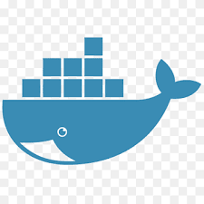

<h1 align="center" >Chat Backend Laravel</h1>

<br/>
<br/>
<br/>


:speech_balloon: [About](#id1)   

:speech_balloon: [Description & requisites](#id2)  

:hammer: [Tools](#id3)

:clipboard: [Instructions](#id4)


:collision: [Deploy](#id5)

:smile: [Thanks](#id6)

---

<a name="id1"></a>

## **About**

<p>Chat Backend Laravel.
It consists of a relational database (MySQL). Made with PHP / Laravel / Artisan Composer, in which we work with those technologies used Visual tools such as DBeaber and Visual Studio Code, this database project has been deployed in Heroku, requirements for which they are.</p>


<a name="id2"></a>

## **Description & requisites**
● **1-.** Users must be able to register to the application,
setting a username / password.

● **2-.** Users have to authenticate to the application by login.

● **3-.** Users have to be able to create Parties (groups) for a
certain video game.

● **4-.** Users have to be able to search Games by selecting a
videogame.

● **5-.** Users can enter and exit a Party.

● **6-.** Users have to be able to send messages to the Party. These
messages have to be able to be edited and deleted by their creator user.

● **7-.** The messages that exist to a Party must be viewed as a
common chat.

●**8-.** Users can enter and modify their profile data, for
For example, your Steam user.

<a name="id3"></a>
## Tools

|  | Visual Studio Code |

|  | Laravel | 

|  | PHP | 

|  | MySql | 

|  | Docker | 

|  | Heroku | 

|  | Git |

|  | GitHub | 


## Laravel Sponsors

We would like to extend our thanks to the following sponsors for funding Laravel development. If you are interested in becoming a sponsor, please visit the Laravel [Patreon page](https://patreon.com/taylorotwell).

### Instructions
<a name="id4"></a>

###### How to clone and start this repository you need to install
- We will install
```php
composer global require laravel/installer
```
- Create the project
```php
laravel new gameChat
```
- Create the models/migrations and controllers 
```php
  ● Party
php artisan make:model Party
php artisan make:migration create_parties
php artisan make:controller PartyController --api --model=Party

● Game
php artisan make:model Game
php artisan make:migration create_games
php artisan make:controller GameController --api --model=Game
php artisan make:migration create_partyusers

● Posts
php artisan make:model Post
php artisan make:migration create_Posts
php artisan make:controller PostsController --api --model=Posts

● PartyUsers
php artisan make:model PartyUser
php artisan make:migration create_partyusers
php artisan make:controller PartyUserController --api 
--model=PartyUsers

```

- After making the relationship we have a database like this.
</img>


- Once the relationships are created, we install passport

```php
php artisan passport:install
```
- registered with postman
</img>

-  Login.
</img>

- Only admin cannot create games.
</img>